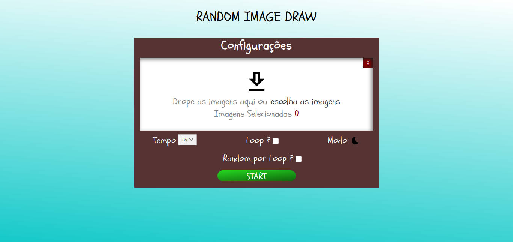

# 
Random Image Draw

### Random Image Draw é um randomizador de imagens com um temporizador para se praticar a arte do desenho
---
- **Como usar:**
Você irá importar uma quantidade maior que duas imagens, escolher um tempo máximo para você ter de desenhar essas imagens, iniciar e começar a praticar. 